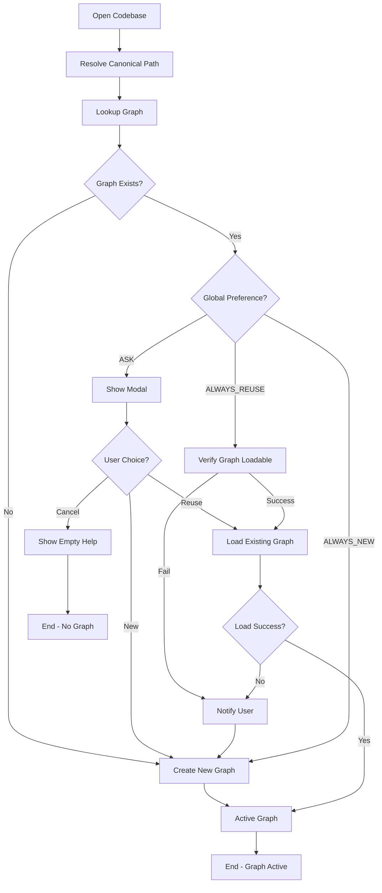

# Persistent Graphs Per Codebase - Developer Documentation

## Overview

This document describes the internal architecture and decision flow for Shotgun's persistent graph management system. This system allows Shotgun to remember codebase analysis between sessions, providing instant startup and preserved knowledge.

## Architecture Stages

The persistent graph system was implemented in 6 stages:

1. **Stage 1**: Path-based persistence and lookup primitives
2. **Stage 2**: Global preference and decision logic
3. **Stage 3**: Per-path modal behavior and state transitions
4. **Stage 4**: Minimal UI hooks for graph management
5. **Stage 5**: Error and edge-case handling
6. **Stage 6**: Documentation (this document)

## Decision Flow (Stages 1-3)

### Path Canonicalization (Stage 1)

When a codebase is opened, the raw path is first converted to a canonical form:

```python
canonical_path = resolve_canonical_path(raw_path)
```

**What it does:**
- Converts to absolute path
- Resolves symlinks
- Normalizes path separators (platform-specific)
- Handles edge cases (symlink loops, permission errors)

**Fallback behavior:**
- If symlink resolution fails, falls back to absolute path without resolution
- Logs warning but continues gracefully

### Graph Lookup (Stage 1)

Using the canonical path, check if a saved graph exists:

```python
existing_graph = await lookup_graph_for_path(canonical_path, graph_manager)
```

**What it does:**
- Generates deterministic graph ID from canonical path (SHA256 hash, 12 chars)
- Queries graph registry for that ID
- Returns `CodebaseGraph` if found, `None` otherwise

**Error handling (Stage 5):**
- Database connection failures → returns `None`
- Permission errors → returns `None`
- Corruption errors → returns `None`
- All failures are logged and treated as "no existing graph"

### Decision Logic (Stage 2)

Determine what action to take based on global preference and graph existence:

```python
decision = decide_graph_open_action(canonical_path, global_behavior, existing_graph)
```

**Decision matrix:**

| Existing Graph? | Global Behavior | Action | Modal Shown? |
|----------------|-----------------|--------|--------------|
| No | Any | Create new | No |
| Yes | `ASK` | Ask user | **Yes** |
| Yes | `ALWAYS_REUSE` | Reuse | No |
| Yes | `ALWAYS_NEW` | Create new | No |

### State Machine Diagram



**ASCII version:**
```
┌─────────────────┐
│  Open Codebase  │
└────────┬────────┘
         │
         ▼
┌──────────────────────┐
│ Resolve Canonical    │
│ Path                 │
└──────────┬───────────┘
           │
           ▼
┌──────────────────────┐
│ Lookup Graph for     │
│ Path                 │
└──────────┬───────────┘
           │
           ▼
      ┌────────┐
      │ Graph  │
      │ Exists?│
      └────┬───┘
           │
    ┌──────┴──────┐
    │             │
   NO            YES
    │             │
    ▼             ▼
 ┌──────┐   ┌──────────┐
 │Create│   │ Global   │
 │ New  │   │Preference│
 │Graph │   └────┬─────┘
 └──┬───┘        │
    │      ┌─────┼─────┐
    │      │     │     │
    │     ASK  REUSE  NEW
    │      │     │     │
    │      ▼     ▼     │
    │   ┌────┐ ┌────┐ │
    │   │Show│ │Load│ │
    │   │Modal│ │Graph│ │
    │   └─┬──┘ └─┬──┘ │
    │     │      │     │
    └─────┴──────┴─────┘
           │
           ▼
    ┌──────────────┐
    │ Active Graph │
    └──────────────┘
```

## Modal Behavior (Stage 3)

### When Modal Appears

The `GraphDecisionModal` appears when:
- An existing graph is found for the codebase path
- AND global behavior is set to `ASK`

### Modal Options

**Three buttons:**

1. **Reuse saved graph** (`GraphChoice.REUSE`)
   - Loads the existing graph
   - Skips re-indexing
   - Instant startup

2. **Start a new graph** (`GraphChoice.NEW`)
   - Creates a fresh graph, replacing the old one
   - Triggers indexing flow
   - User confirms via CodebaseIndexPromptScreen

3. **Cancel** (dismiss or `GraphChoice.CANCEL`)
   - Shows empty directory help text
   - No graph becomes active
   - User can manually trigger indexing later

**Optional checkbox:**
- **"Remember this choice as my global default"**
  - If checked with Reuse → sets global behavior to `ALWAYS_REUSE`
  - If checked with New → sets global behavior to `ALWAYS_NEW`
  - Persists to `~/.shotgun-sh/config.json`

### Dismissal Behavior (Stage 5)

If user dismisses the modal without selecting an option:
- Treated same as Cancel button
- Shows empty directory help text
- No graph becomes active
- Consistent with "ask until resolved" approach

## Settings and UI Surfaces (Stage 4)

### PersistentGraphOpenBehavior Enum

Defined in `src/shotgun/agents/config/models.py`:

```python
class PersistentGraphOpenBehavior(str, Enum):
    ASK = "ask"                    # Show modal when graph exists
    ALWAYS_REUSE = "always_reuse"  # Auto-load without asking
    ALWAYS_NEW = "always_new"      # Always create new without asking
```

**Default value:** `ASK`

**Storage location:** `~/.shotgun-sh/config.json`

**Config key:** `persistent_graph_open_behavior`

### UI Components

#### 1. GraphIndicator (Footer Widget)

**Location:** Bottom-right footer of ChatScreen

**Display:**
- Shows current graph name and entity count
- Format: `"Graph: <name> (X entities)"` or `"No graph"`
- Clickable to open graph selector

**File:** `src/shotgun/tui/components/graph_indicator.py`

#### 2. GraphSettingsModal

**Opens via:**
- Command Palette: `Ctrl+P` → "Graph: Settings"
- GraphSelectorModal: "Settings..." button

**Contains:**
- Title: "Graph Behavior Preferences"
- Radio selection (ListView):
  - ○ Ask me each time (default)
  - ○ Always reuse existing graph
  - ○ Always create new graph
- Buttons: Save, Cancel

**File:** `src/shotgun/tui/screens/chat/graph_settings_modal.py`

#### 3. GraphSelectorModal

**Opens via:**
- Click GraphIndicator widget in footer
- Command Palette: "Graph: Switch Graph"

**Contains:**
- List of available graphs for current directory
- Each entry shows: name, entity count, last modified
- Current graph is highlighted
- Buttons:
  - **Use Selected**: Switch to selected graph
  - **Create New Graph**: Start fresh graph
  - **Settings...**: Open GraphSettingsModal
  - **Cancel**: Close without changing

**File:** `src/shotgun/tui/screens/chat/graph_selector_modal.py`

#### 4. GraphDecisionModal

**Opens automatically when:**
- Opening a codebase with existing graph
- AND global behavior is `ASK`

**Contains:**
- Graph info: name, entity count, last opened
- Buttons:
  - **Reuse saved graph**
  - **Start a new graph**
  - **Cancel**
- Checkbox: "Remember this choice as my global default"

**File:** `src/shotgun/tui/screens/chat/graph_decision_modal.py`

#### 5. Command Palette Integration

**Available commands:**
- `Graph: Switch Graph` → Opens GraphSelectorModal
- `Graph: Settings` → Opens GraphSettingsModal
- `Graph: Create New Graph` → Creates new graph for current directory

**Provider:** `GraphManagementProvider` in `src/shotgun/tui/screens/chat_screen/command_providers.py`

### Top-Bar Graph Control (Future)

*Note: Current implementation uses footer indicator instead of top-bar control*

**Planned location:** Top bar or persistent chrome

**Planned behavior:**
- Display: `Graph: <currentGraphLabel>`
- Click → dropdown with:
  - Non-interactive: `Current graph: <label>`
  - Action: `Start a new graph for this codebase`
  - Action: `Graph preferences...`

## Error Handling (Stage 5)

### Lookup Failures

**What happens:**
- `lookup_graph_for_path()` catches all exceptions
- Logs warning with error details
- Returns `None` (treated as "no existing graph")
- Flow continues normally, creating new graph

**Error types handled:**
- Database connection failures
- Permission denied
- File corruption
- Missing database files

**User impact:**
- Seamless fallback to creating new graph
- No disruption to workflow

### Graph Load Failures After REUSE Decision

**What happens:**
1. After decision to REUSE (auto or manual):
   ```python
   graph = await graph_manager.get_graph(graph_id)
   ```
2. If load fails (exception):
   - Log warning with error details
   - Show toast notification to user:
     ```
     "Could not load the saved graph.
      A new graph will be created for this codebase."
     ```
   - Fall through to NEW graph flow
   - Trigger indexing as if user chose "new"

**User experience:**
- Clear notification of what went wrong
- Automatic fallback keeps workflow moving
- 8-second toast with "warning" severity
- No stuck state, always have a graph

### Path Resolution Failures

**What happens:**
- `resolve_canonical_path()` catches OSError, RuntimeError
- Falls back to absolute path without symlink resolution
- Logs warning
- Returns valid path string

**Scenarios:**
- Symlink loops
- Too many symlink levels
- Permission denied during resolution

## Integration Guide for Contributors

### When Adding New Codebase Entry Points

If you're adding a new way to open or initialize a codebase, you **must** integrate with the persistent graph system.

**Required steps:**

1. **Import the decision flow function:**
   ```python
   from shotgun.codebase.graph_open_flow import determine_graph_action_for_codebase
   ```

2. **Get the graph manager:**
   ```python
   graph_manager = codebase_sdk.service.manager  # or however you access it
   ```

3. **Call the decision flow:**
   ```python
   decision = await determine_graph_action_for_codebase(
       codebase_path,
       graph_manager,
       config_manager=None  # Uses singleton
   )
   ```

4. **Handle the decision:**
   ```python
   if decision.should_reuse:
       # Graph exists and user wants to reuse
       # Verify it loads (with error handling!)
       try:
           await graph_manager.get_graph(decision.existing_graph.graph_id)
           # Success - update UI state
       except Exception as e:
           # Failed - notify user and fall through to create new
           app.notify("Could not load graph...", severity="warning")
           # Fall through to create new graph

   if decision.should_ask_user and decision.existing_graph:
       # Show modal and get user choice
       result = await app.push_screen_wait(GraphDecisionModal(decision.existing_graph))

       if result and result.choice == GraphChoice.REUSE:
           # Same as should_reuse above
       elif result and result.choice == GraphChoice.NEW:
           # Fall through to create new
       else:
           # User cancelled - handle appropriately

   # If should_create_new or user chose new:
   # Proceed with normal indexing flow
   ```

### DO NOT:

❌ **Bypass the decision function** - Always call `determine_graph_action_for_codebase()`

❌ **Skip error handling** - Always wrap graph loading in try-except

❌ **Hardcode behavior** - Respect the user's global preference

❌ **Create graphs directly** - Use `create_graph_for_path()` which handles ID generation

❌ **Forget path canonicalization** - The decision flow handles this for you

### Example: New CLI Command

```python
@app.command()
async def my_command(path: str):
    """New command that works with a codebase."""
    from shotgun.codebase.graph_open_flow import determine_graph_action_for_codebase

    # Get dependencies
    graph_manager = get_graph_manager()

    # Use the decision flow
    decision = await determine_graph_action_for_codebase(path, graph_manager)

    if decision.should_reuse:
        try:
            graph = await graph_manager.get_graph(decision.existing_graph.graph_id)
            print(f"Using existing graph: {graph.name}")
        except Exception as e:
            print(f"Failed to load graph, creating new one")
            # Fall through to create new

    if decision.should_ask_user:
        # For CLI, you might want to auto-choose or prompt differently
        choice = input("Reuse existing graph? [Y/n]: ")
        if choice.lower() != 'n':
            # Load existing
            pass
        else:
            # Create new
            pass

    # Proceed with your command logic
```

### Testing Integration

When writing tests for code that uses the graph system:

1. **Mock the decision flow:**
   ```python
   with patch('module.determine_graph_action_for_codebase') as mock_decide:
       mock_decide.return_value = GraphOpenDecision(
           action=GraphOpenAction.CREATE_NEW,
           canonical_path="/test/path",
           existing_graph=None
       )
       # Your test code
   ```

2. **Test all decision outcomes:**
   - No existing graph (CREATE_NEW)
   - Existing graph with ASK (should_ask_user)
   - Existing graph with ALWAYS_REUSE (should_reuse)
   - Existing graph with ALWAYS_NEW (CREATE_NEW)

3. **Test error scenarios:**
   - Graph lookup fails
   - Graph load fails after REUSE
   - Path canonicalization edge cases

## File Reference

### Core Implementation

- **`src/shotgun/codebase/persistence.py`** - Stage 1 primitives (path, lookup, create)
- **`src/shotgun/codebase/graph_decision.py`** - Stage 2 decision logic
- **`src/shotgun/codebase/graph_open_flow.py`** - Integrated flow combining 1+2

### UI Components

- **`src/shotgun/tui/components/graph_indicator.py`** - Footer widget
- **`src/shotgun/tui/screens/chat/graph_decision_modal.py`** - ASK modal (Stage 3)
- **`src/shotgun/tui/screens/chat/graph_selector_modal.py`** - Switch graphs (Stage 4)
- **`src/shotgun/tui/screens/chat/graph_settings_modal.py`** - Preferences (Stage 4)
- **`src/shotgun/tui/screens/chat_screen/command_providers.py`** - Command palette

### Models and Config

- **`src/shotgun/codebase/models.py`** - `CodebaseGraph`, `GraphStatus`
- **`src/shotgun/agents/config/models.py`** - `PersistentGraphOpenBehavior`
- **`src/shotgun/agents/config/manager.py`** - Config persistence

### Tests

- **`test/unit/codebase/test_persistence.py`** - Stage 1 + Stage 5 error tests
- **`test/unit/codebase/test_graph_decision.py`** - Stage 2 decision logic
- **`test/unit/tui/components/test_graph_indicator.py`** - Stage 4 widget
- **`test/unit/tui/screens/test_graph_decision_modal.py`** - Stage 3 modal
- **`test/unit/tui/screens/test_graph_selector_modal.py`** - Stage 4 modal
- **`test/unit/tui/screens/test_graph_settings_modal.py`** - Stage 4 modal

## Future Enhancements

Potential future improvements to the persistent graph system:

1. **Multi-graph support** - Allow multiple graphs per codebase (e.g., per-branch)
2. **Graph metadata editing** - Rename, add notes to graphs
3. **Graph deletion with confirmation** - Remove old graphs via UI
4. **Graph search/filtering** - Find graphs by name, date, size
5. **Graph sharing** - Export/import graphs for team collaboration
6. **Graph analytics** - Show statistics on graph usage, age, size
7. **Automatic graph cleanup** - Remove stale graphs after N days
8. **Top-bar control** - Add top-bar dropdown as originally planned

## See Also

- **`README.md`** - User-facing documentation for persistent graphs
- **`.shotgun/plan.md`** - Original design document with detailed requirements
- **`.shotgun/tasks.md`** - Implementation checklist (Stages 1-6)
